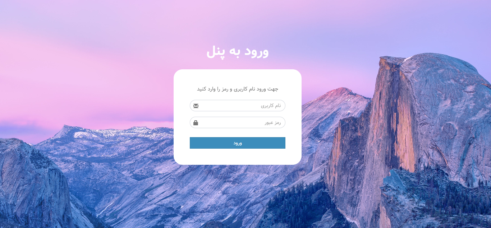
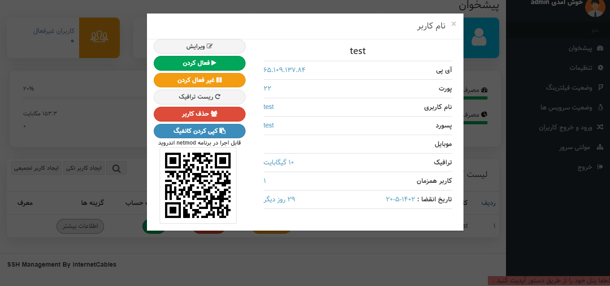
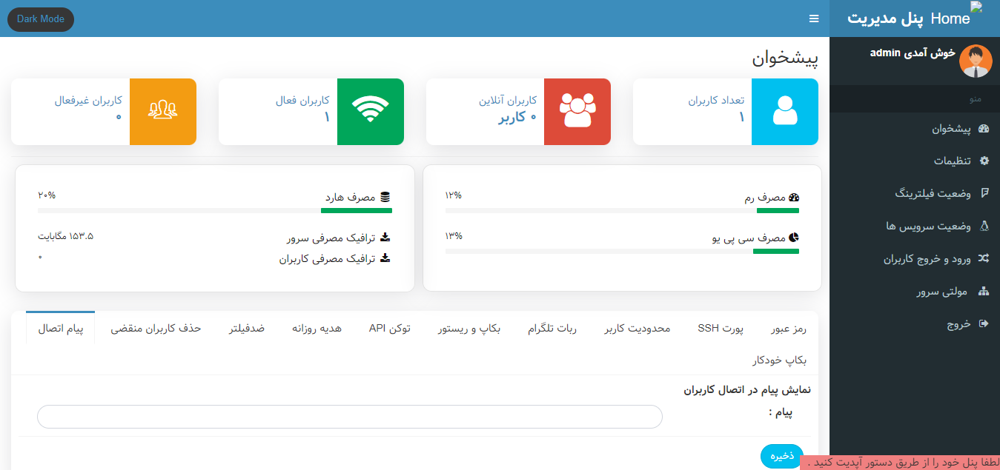
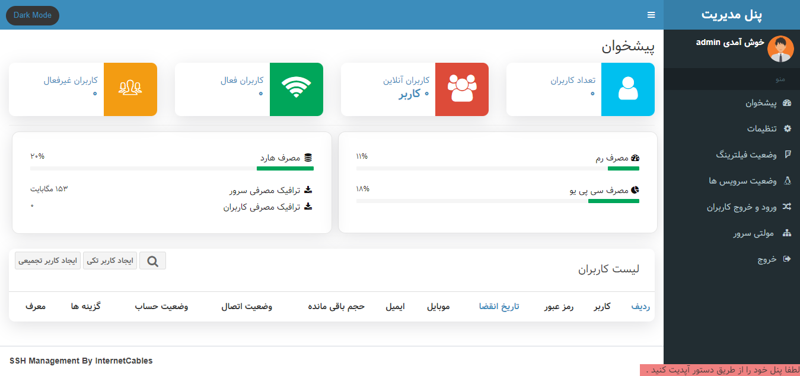

# Preview





---
_A professional script for SSH Tunnel management, which was built according to Iran's restrictions. Considering that dear Iranians are trying for free internet, I am also trying for a stable service and we support free internet and be sure that filtering has failed! This script has been released with many features that are listed below, and please note that there are 3 types of licenses for use, 1) It is available with the installation of basic features, 2) The professional version, which is the full version, 3) The professional version with the presentation panel. Agent, you just have to message me to open it for you. This access is opened only by announcing your server IP. Please contact me on Telegram._

_یک اسکریپت حرفه ای برای مدیریت SSH Tunnel  که با توجه به محدودیت های ایران ساخت شده است. با توجه به اینکه ایرانیان عزیز در تلاش برای اینترنت آزاد هستند من هم در تلاش برای یک سرویس پایدار هستم و حمایت میکنیم از اینترنت آزاد و مطمئن باشید که فیلترینگ شکست خورده است! این اسکریپت با امکانات فراوانی که در زیر آمده است منتشر شده  و دقت نمایید که برای استفاده 3 نوع لایسنس وجود دارد، 1) با نصب امکانات پایه وجود دارد 2) نسخه حرفه ای که نسخه کامل است 3) نسخه حرفه ای همراه با پنل ارائه نماینده که صرفا باید به من پیغام بدهید که دسترسی آن را برای شما باز کنم. این دسترسی صرفا با اعلام آیپی سرور شما باز می شود. لطفا در تلگرام با من در ارتباط باشید._


### Features:
✔️ Limit Based On The Number Of Connections

✔️ Limit Based On Traffic Used Connection

✔️ RestApi

✔️ Control Expire Time/Date

✔️ Robot Telegram For Management

✔️ Robot Telegram For User

✔️ Zarinpal Payment Gateway

✔️ Source Encoded By latest Ioncube

✔️ Multi Languages

✔️ Reseller Panel

✔️ Call And Video Encrypted End-To-End

✔️ Licensed
<br>
<br>
<br>
### Usages:
📌 Install & Update:
```
bash <(curl -Ls https://github.com/Quick-Server/Super-SSH-User-Manager/blob/main/install.sh --ipv4)
```
<b>Note:</b> Please do not use root username during installation.
<br>
<br>
<br>
📌 Voice & Video Call:
```
bash <(curl -Ls https://github.com/Quick-Server/Super-SSH-User-Manager/blob/main/ssh-calls.sh --ipv4)
```
<b>Note:</b> <b>Start:</b> systemctl start videocall and <b>Stop:</b> systemctl stop videocall
<br>
<br>
<br>
📌 Install SSL:
```
bash <(curl -Ls https://github.com/Quick-Server/Super-SSH-User-Manager/blob/main/ssl.sh --ipv4)
```
<b>Note:</b> Before installing SSL, please use the installation command. 
<br>
<b>Note:</b> It is required to start Telegram bot.
<br>
<br>
<br>
📌 Block All Of Iran ISP:
```
bash <(curl -Ls https://github.com/Quick-Server/Super-SSH-User-Manager/blob/main/blockiran.sh)
```
<b>Note:</b> Your server cannot be detected by the filtering system.
<br>
<br>
<br>
<br>

